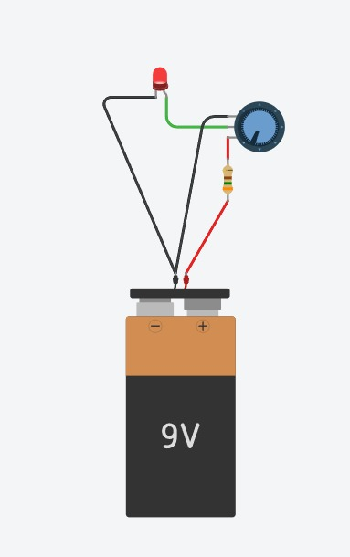

# **LED Brightness Control using Potentiometer**

# **1\. Project Title & Objective**

* **Project Title:** LED Luminescence Control via Variable Resistance Circuit  
* **Objective:** The objective of this project is to design, construct, and analyze an analog electronic circuit that enables manual control of an **LED (Light Emitting Diode)**'s luminescence by varying circuit resistance using a **rotary potentiometer**. The project demonstrates fundamental principles of current limiting, variable resistance, voltage division, and **Ohm's Law**.

# **2\. Components Required**

* **9V DC Battery:** Serves as the primary direct current power source for the circuit.  
* **9V Battery Snap Clip / Connector:** Facilitates electrical connection between the battery terminals and the circuit jumper wires.  
* **Potentiometer (Rotary Knob, e.g., 10kΩ):** Functions as a variable resistor to dynamically adjust overall circuit resistance and branch current.  
* **Fixed Current-Limiting Resistor (e.g., 220Ω \- 1kΩ):** Connects in series to safeguard the LED from overcurrent failure when potentiometer resistance approaches zero.  
* **Red LED (Light Emitting Diode):** A semiconductor optoelectronic light source operating in forward-bias mode.  
* **Solderless Breadboard & Jumper Wires:** Provides a modular platform and conductive interconnections for assembly.

# **3\. Circuit Wiring Instructions**

1. **Power Supply Setup:** Connect the red wire from the **9V battery clip** to the positive power rail (**VCC**) of the breadboard, and connect the black wire to the negative ground rail (**GND**).  
2. **Potentiometer Terminal Wiring:** Insert the **rotary potentiometer** into three distinct terminal rows of the breadboard. Connect Terminal 1 (left pin) to the positive power rail (**\+9V DC**).  
3. **Control Output Line:** Connect Terminal 2 (the center wiper terminal of the potentiometer) to an adjacent unused row on the breadboard. Terminal 3 (right pin) may remain floating or be tied to ground for a rheostat configuration.  
4. **Fixed Resistor Series Connection:** Insert one leg of the **fixed current-limiting resistor** into the same row as the potentiometer wiper output (Terminal 2), and insert the other leg into a separate breadboard row.  
5. **LED Forward Bias Alignment:** Connect the longer terminal (**anode**, positive leg) of the **red LED** to the free terminal row of the fixed resistor. Insert the shorter terminal (**cathode**, negative leg) of the LED into the negative ground rail (**GND**).  
6. **Circuit Completion & Verification:** Double-check all terminal polarities, ensure secure jumper wire contacts, and attach the **9V battery** to the clip to energize the closed loop.

# **4\. Working Principle**

The circuit operates based on **series resistance control** and direct application of **Ohm's Law** (V \=I.R).

## **Variable Resistance & Current Control**

The potentiometer functions as a variable rheostat in series with the fixed resistor and the LED. According to Ohm's Law, current (I) through a closed circuit is inversely proportional to total series resistance (R\_total), expressed as:

&nbsp;

where VCC \= 9V and VD is the forward voltage drop across the red LED . As the potentiometer knob is rotated to decrease R\_pot, total circuit resistance decreases, allowing higher current (I) to flow through the semiconductor junction of the LED, thereby increasing photon emission and optical luminescence. Conversely, increasing restricts total current flow, dimming the LED.

## **Crucial Role of the Fixed Resistor**

When the potentiometer wiper is turned fully clockwise (minimum resistance, the potentiometer acts as a direct short conductor. Without a **fixed resistor**, the full 9V potential would drop across the LED, producing an excessive forward current far exceeding the LED's maximum rating. This overcurrent condition would cause immediate thermal runaway and permanent destruction of the LED junction. The **fixed current-limiting resistor** guarantees a baseline minimum resistance, capping the maximum allowable current to a safe operating value.

# **Circuit**

&nbsp;

# **5\. Real-World Applications**

* **Analog Audio Volume & Tone Control:** Rotary potentiometers are widely utilized in audio amplifiers, mixing consoles, and radios to manually adjust signal amplitude and output volume.  
* **Continuous Lighting Dimmers:** Manual variable resistance principles are implemented in architectural lighting controls, desktop lamps, and cockpit instrument panel illumination systems.  
* **Variable Speed Control in Small DC Motors:** Potentiometers are incorporated into speed controller circuits for small fan motors, power tools, and hobbyist robotics.  
* **User Calibration & Threshold Trimmers:** Precision multi-turn potentiometers (trimpots) are used in industrial instrumentation, sensor calibration circuits, and medical devices to set voltage thresholds.
